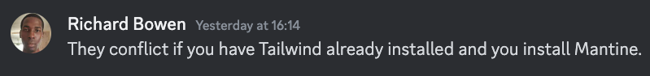
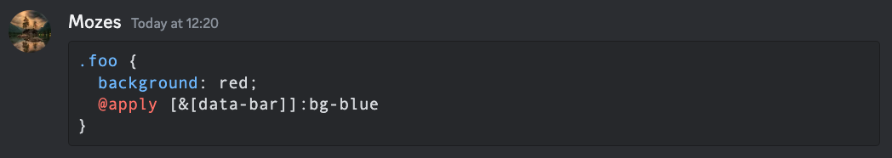
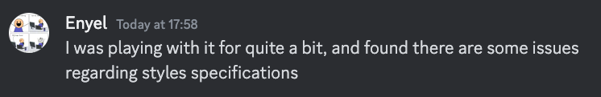
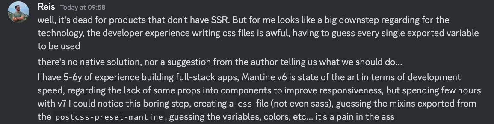
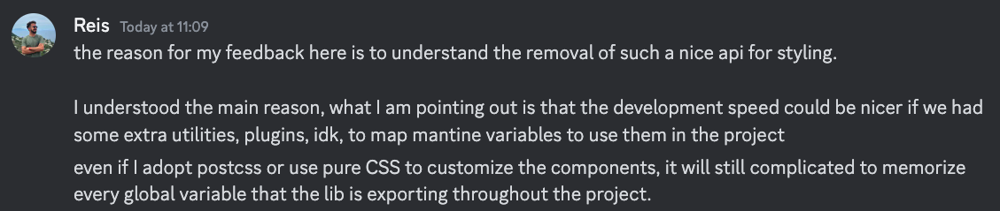
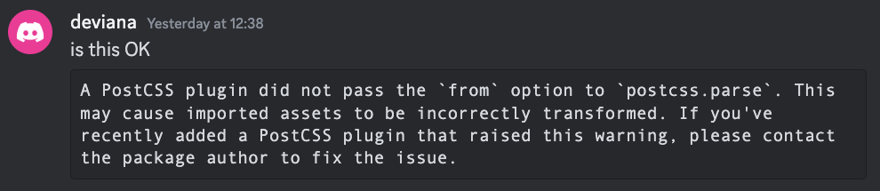
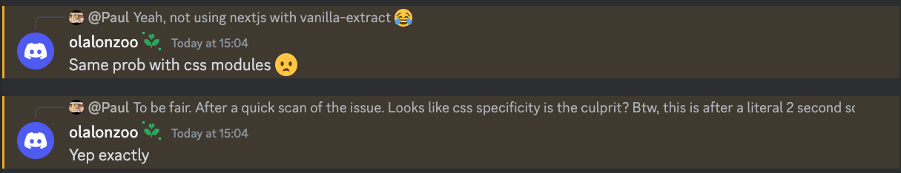
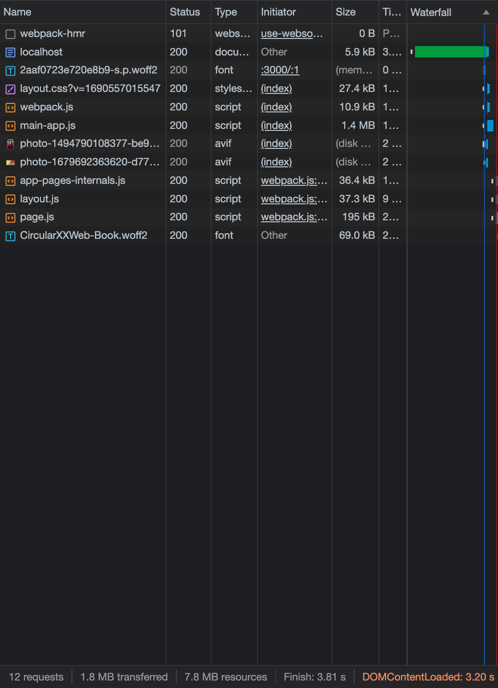
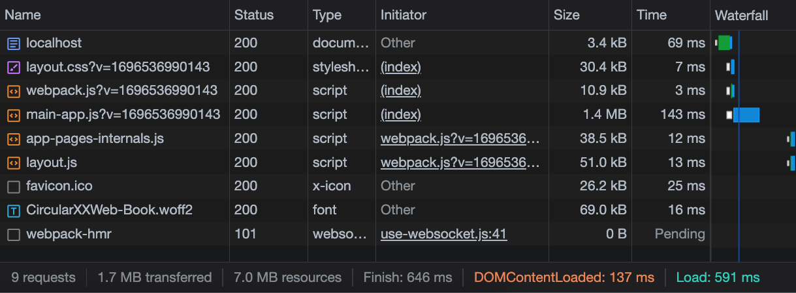

<!-- PROJECT LOGO -->

<a name="readme-top"></a> <br />

<div align="center">
  <a href="https://github.com/paulm17/raikou">
    
  </a>
  <h3 align="center">RAIKOU</h3>
  <p align="center">
    Raikou is a mantine fork which replaces css modules to adopt a tailwind first-use approach.
  </p>
</div>

<!-- ABOUT THE PROJECT -->

## About The Project

Mantine 6 with CSS-in-JS allowed for styles to be adjacent to the component it
was styling. However with Mantine 7 styling has switched to CSS Modules. Many in
the industry see CSS Modules as a step backwards and I (the fork author) share
this sentiment. Therefore forking the project to integrate tailwind was the
obvious choice.

The project was conceived with these 4 long-term goals:

1. To make as many components
   <a href="https://nextjs.org/_next/image?url=%2Fdocs%2Fdark%2Fthinking-in-server-components.png&w=3840&q=75">server
   aware</a>.
2. To ensure proper tree-shaking for components and purging of unused css. (TBD,
   waiting for vercel to resolve the client bundle to be tree-shakable)
3. To ensure that there were no clashes between the bootstrapped CSS of the
   component and tailwind styles provided, when using the ClassNames API. This
   has been made possible with tailwind loading the css styles via a plugin
   architecture. See for
   <a href="https://tailwindcss.com/docs/plugins#css-in-js-syntax">more
   information</a>.
4. To reduce the amount of data sent over each full request:
   - By leveraging the new server paradigm. All the layout components would be
     server based, giving an opportunity to reduce client payload when used
     correctly. Therefore all layout components are server based and leaf
     components being a mixture of both server and client.
   - (in future) Using a css purging strategy. Loading CSS for only the
     components in use.

## Project Caveats

1.  Remix, Svelte, Solid, Astro, Qwik and any other javascript frameworks are
    not supported. There are no intentions of supporting anything other than
    NextJS.
2.  There may be design decisions implemented that will diverge from Mantine.

    - Styles API layer has been removed because it has been superseded by the
      Classes API and Styles API is
      <a href="https://v7.mantine.dev/styles/styles-performance#inline-styles">very
      slow</a>.
    - Mantine and Raikou employ different approaches to manage the theme. While
      Mantine uses context. Raikou utilizes a global Zustand state for both
      server and client rendering.
    - The code responsible for the ColorScheme has been replaced with a more
      lightweight version using
      <a href="https://github.com/pacocoursey/next-themes">Next Themes</a>.
    - When customising a theme, some functionality is encapsulated in a string
      so that the theme can be passed from a server component to a client
      component.
    - Some components have had their javascript removed to make them server
      components primarily.
    - All 10 colors have been removed, as tailwind comes with it's own color
      system. Raikou comes with a default color. Should there exist a
      requirement to add your own colors. Supply them in a theme object.
      Additionally, Raikou has the ability to change many aspects of the theme.
      See
      <a href="https://github.com/paulm17/raikou/blob/main/packages/raikou/system/src/core/RaikouProvider/css-variables.plugin.ts">the
      options available to each component</a>. Change these settings using
      cssVariablesResolver and example is below.

<p align="right">(<a href="#readme-top">back to top</a>)</p>

## Why not integrate tailwind with mantine in the App?

Integrating Tailwind with mantine at the app layer raises the complexity of the
stack. Not only does the issue of css specificity come up, but other issues are
present.

<ul style="list-style: none">
   <li>
      
   </li>
   <li>
      
   </li>
   <li>
      
   </li>
</ul>

### CSS Modules is the wrong choice

Less headaches in dealing with postcss from a developer UX point of view.

<ul style="list-style: none">
   <li>
      
   </li>
   <li>
      
   </li>
   <li>
      
   </li>
   <li>
      
   </li>
</ul>

<p align="right">(<a href="#readme-top">back to top</a>)</p>

### Built With

[![React][React.js]][React-url]

<p align="right">(<a href="#readme-top">back to top</a>)</p>

### Mirrored Mantine release

0.0.1-beta.9 = 7.1.5

<!-- GETTING STARTED -->

## Getting Started

To get a local copy up and running follow these simple example steps.

### Installation to a NextJS 13 application

1. Install the required packages. Same as Mantine.

- npm

```sh
npm install @raikou/client @raikou/hooks @raikou/server @raikou/system @raikou/global-store postcss-removecss-raikou
```

- yarn

```sh
yarn add @raikou/client @raikou/hooks @raikou/server @raikou/system @raikou/global-store postcss-removecss-raikou
```

2. Change the postcss.config.js to:

```js
module.exports = {
  plugins: {
    "tailwindcss/nesting": {},
    tailwindcss: {},
    autoprefixer: {},
  },
};
```

Note: There will be complaints in the log about tailwind nesting issues. These
are not prevalent with the next release of tailwind.

3. Add a new plugin to the postcss.config.js to purge unused component library
   styles

```js
"postcss-removecss-raikou": {
   appPath: "./app",
   libPath: [
   "./node_modules/@raikou/client/dist/index.mjs",
   "./node_modules/@raikou/server/dist/index.mjs",
   ],
   exts: [".tsx"],
},
```

Change appPath to where the tsx files for your project reside.

4. Change the content param in tailwind config, to pick up the component Library

```js
content: [
   "./node_modules/@raikou/**/*.js",
   "./src/app/**/*.{js,ts,jsx,tsx,mdx}",
],
```

Note: If cloning the repo. The webapp will have a more extensive content
listing. This is due to glob breaking NextJS HMR.

5. Add this preset param in the tailwind config. Without this, css styling does
   not work.

```js
presets: [require("@raikou/system/plugin.js")],
```

6. Amend layout.tsx to resemble the following. RaikouProvider must encapsulate
   the children. It should resemble something like the following:

```js
import { RaikouProvider } from '@raikou/system';

export default function RootLayout({
   children,
}: {
   children: React.ReactNode
}) {
   return (
      <html lang="en">
         <body className={inter.className}>
            <RaikouProvider>{children}</RaikouProvider>
         </body>
      </html>
   )
}
```

Note, the default primary color is blue: #5474B4.

7. If there is a requirement to modify the theme. For example changing the
   primary color to orange. Update layout.tsx as follows:

```js
import { RaikouProvider } from '@raikou/system';
import { createTheme, setState } from '@raikou/global-store';
import { generateColors } from "@raikou/colors-generator";

export default function RootLayout({
   children,
}: {
   children: React.ReactNode
}) {
   const theme = createTheme({
      primaryColor: "orange",
      colors: {
         orange: generateColors("#FF8000"),
      },
   });

   setState(theme);

   return (
      <html lang="en">
         <body className={inter.className}>
            <RaikouProvider theme={theme}>{children}</RaikouProvider>
         </body>
      </html>
   )
}
```

Note: The 10 colors for the primary color will then be generated at the :root
pseudo-class.

8. The theme components api has changed from the
   <a href="https://v7.mantine.dev/styles/variants-sizes#sizes-with-components-css-variables">original
   documentation</a>:

```js
components: {
   Button: {
      vars: `
      if (props.size === "xxl") {
         return {
            root: {
            "--button-height": rem(60),
            "--button-padding-x": rem(30),
            "--button-fz": rem(30),
            },
         };
      }

      return { root: {} };
      `,
   },
},
```

9. To override css variable, create an object:

```js
const resolver = {
  light: {
    ".button-root": {
      "--raikou-button-disabled-bg": "#E17900",
    },
  },
  dark: {
    ".button-root": {
      "--raikou-button-disabled-bg": "#FC8C0C",
    },
  },
};
```

Then update the RaikouProvider.

```js
<RaikouProvider
  theme={theme}
  cssVariablesResolver={`return ${JSON.stringify(resolver)}`}
>
  {children}
</RaikouProvider>
```

10. Improve DX for classes API, for VSCode.

In the settings.json file, under .vscode folder. Add the following:

```js
   "tailwindCSS.includeLanguages": {
      "javascript": "javascript react"
   },
   "tailwindCSS.classAttributes": ["className"],
   "tailwindCSS.experimental.classRegex": [":\\s*?[\"'`]([^\"'`]*).*?"]
```

This will enable intellisense for tailwind styles when adding a new entry.

<p align="right">(<a href="#readme-top">back to top</a>)</p>

### Cloning the repo

1. Run the following command

```sh
git clone https://github.com/paulm17/raikou
```

2. Install all the package prerequisites

```sh
pnpm i
```

3. To run the nextjs website

```sh
pnpm run dev
```

4. To run storybook

```sh
pnpm run storybook
```

<p align="right">(<a href="#readme-top">back to top</a>)</p>

<!-- USAGE EXAMPLES -->

## Server Components

There are 41 server components available without the need for "use client" in
either the component library entry point nor in the page itself. They are:
action-icon, alert, anchor, \*app-shell, aspect-ratio, background-image, badge,
blockquote, box, breadcrumbs, button, card, center, close-button, code,
color-swatch, container, divider, fieldset, flex, grid, group, highlight,
\*image, indicator, kbd, list, loader, mark, paper, skeleton, simple-grid,
space, stack, \*table, text, timeline, title, unstyled-button, visually-hidden.

### Changes to components

The following components have been altered from the original mantine spec:

1. App Shell

Used javascript for prettier resizing of the components. This has been removed.

2. Image

Used javascript to replace the image with a fallback, should the source fail to
load. As this is a server component. If the fallback prop is used, the server
does a request to see if the source exists. If it does not then the fallback is
shown. Ensure the fallback is an image you know is dependable.

Should the component be marked as a client component, it is currently out of
scope to determine whether the image has failed to load on the client. At a
future date this maybe resolved.

3. Table

Used javascript for allowing the body to be scrollable. In future, will look how
to inject back this functionality should the table be a client component.

## Server component usage

To use a server component do the following:

```js
import { Badge } from "@raikou/server";

return <Badge>Hello</Badge>;
```

No client payload will be sent to the server. However to use as a client
component, just include "use client"

```js
"use client";
import { Badge } from "@raikou/server";

return <Badge>Hello</Badge>;
```

And the page will include all the neccessary client payload for the Badge and
the page.

## Server Components - Mantine vs Raikou

Using the default NextJS 13 install. Here is an example of just 1 component:
Badge (with Mantine + Raikou using "use client" + full css payload).

Stats are taken using this method. Open up a tab with dev tools network. Run
with yarn dev and then put in http://localhost:3000 in the browser.

##### Network tabs (Mantine vs Raikou)

<p float="left">
  
  
</p>

##### Raikou server vs client

When omitting "use client" this results in Page.js not being requested.

<p float="left">
   
</p>

<p align="right">(<a href="#readme-top">back to top</a>)</p>

<!-- ROADMAP -->

## Roadmap

- [x] Create a postcss script to purge unused CSS
- [x] Enable react server components and split packages to server and client
- [x] Tree-shaking for client build
- [x] Replace the context provider that components use for state
- [x] Match or significantly improve the amount of data that is sent on each
      full request
- [x] Replace Mantine ColorScheme code with Next-Themes
- [ ] Upgrade tailwind to the new release supporting LightningCSS (tailwind v4?)
- [ ] With the new tailwind release, migrate the postcss script to a
      LightningCSS transformer. Investigate a Rust port.
- [ ] With the new tailwind release, investigate whether it's possible to port
      the current plugins to css files and whether components can access the
      theme
- [x] Create a <a href="https://daisyui.com/docs/themes/">theme switcher</a>
      similar to Daisy UI. See the
      <a href="https://github.com/paulm17/raikou/blob/main/apps/web/app/themer/page.tsx">/themer
      endpoint</a>.
- [ ] Fix the Storybook demos to work under version 7

<p align="right">(<a href="#readme-top">back to top</a>)</p>

<!-- CONTRIBUTING -->

## Contributing

Contributions are what make the open source community such an amazing place to
learn, inspire, and create. Any contributions you make are **greatly
appreciated**.

If you have a suggestion that would make this better, please fork the repo and
create a pull request. You can also simply open an issue with the tag
"enhancement".

Don't forget to give the project a star! Thanks again!

1. Fork the Project
2. Create your Feature Branch (`git checkout -b feature/AmazingFeature`)
3. Commit your Changes (`git commit -m 'Add some AmazingFeature'`)
4. Push to the Branch (`git push origin feature/AmazingFeature`)
5. Open a Pull Request

<p align="right">(<a href="#readme-top">back to top</a>)</p>

<!-- LICENSE -->

## License

Distributed under the MIT License. See `LICENSE.txt` for more information.

<p align="right">(<a href="#readme-top">back to top</a>)</p>

<!-- CONTACT -->

## Contact

Paul M - no social - no email

Project Link:
[https://github.com/paulm17/raikou](https://github.com/paulm17/raikou)

<p align="right">(<a href="#readme-top">back to top</a>)</p>

<!-- ACKNOWLEDGMENTS -->

## Acknowledgments

Vitaly and the Mantine community.

<p align="right">(<a href="#readme-top">back to top</a>)</p>

[React.js]:
  https://img.shields.io/badge/React-20232A?style=for-the-badge&logo=react&logoColor=61DAFB
[React-url]: https://reactjs.org/

<p align="right">(<a href="#readme-top">back to top</a>)</p>
