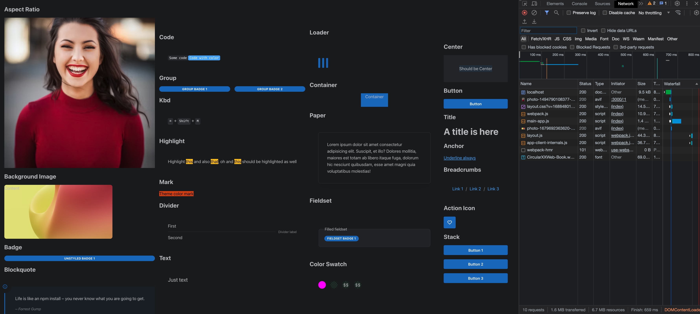

<!-- PROJECT LOGO -->
<br />
<div align="center">
  <a href="https://github.com/paulm17/raikou">
    
  </a>
  <h3 align="center">RAIKOU</h3>
  <p align="center">
    Raikou is a mantine fork which replaces css modules to use tailwind.
    <br />
    <a href="https://github.com/paulm17/raikou/issues">Report Bug</a>
    ·
    <a href="https://github.com/paulm17/raikou/issues">Request Feature</a>
  </p>
</div>

<!-- ABOUT THE PROJECT -->

## About The Project

Mantine 6 with CSS-in-JS allowed for styles to be adjacent to the component it
was styling. However with Mantine 7 styling has switched to CSS Modules. Many in
the industry see CSS Modules as a step backwards and I (the fork author) share
this sentiment. Therefore forking the project to support tailwind was the
obvious choice.

The project was conceived with these 4 long-term goals:

1. To allow for components without hooks to behave as server components and
   should state be introduced on the server side, make all components server
   aware.
2. To ensure proper tree-shaking for components and purging of unused css. (TBD,
   waiting for vercel to resolve the client bundle to be tree-shakable)
3. To switch the theme from react context (state) to the tailwind theme. Thereby
   negating the need to keep the color mode (light/dark) and text direction
   (left/right) in state.
4. When using the ClassNames api, to ensure that there were no clashes between
   the bootstrapped CSS of the component and tailwind styles provided. This has
   been made possible with tailwind loading the styles via a plugin
   architecture. See for
   <a href="https://tailwindcss.com/docs/plugins#css-in-js-syntax">more
   information</a>.

## Project Caveats

1. Remix, Svelte, Solid, Astro and any other frameworks are not supported. There
   are no intentions of supporting anything other than NextJS.
2. There may be design decisions implemented that will diverge from Mantine.
   - Styles API layer may disappear because it has been superseded by the
     Classes API and Styles API is
     <a href="https://v7.mantine.dev/styles/styles-performance#inline-styles">very
     slow</a>.
   - Mantine keeps the theme in state via context. Raikou handles this
     differently. On the server side, the theme is loaded from the file each
     time it is requested. On the client side it is loaded once and then stored
     in a window variable. Each time it is requested, it is taken from that.
   - There are no createTheme function. The tailwind theme is responsible for
     any changes.
   - The code responsible for the ColorScheme has been removed and a more
     lightweight version using Next Themes has been used.
3. Issues may be closed due to the fork author not having free time. If an issue
   is very important, please consider implementing a PR.

<p align="right">(<a href="#readme-top">back to top</a>)</p>

### Built With

[![React][React.js]][React-url]

<p align="right">(<a href="#readme-top">back to top</a>)</p>

<!-- GETTING STARTED -->

## Getting Started

To get a local copy up and running follow these simple example steps.

### Installation to a NextJS 13 application

1. Install the required packages. Same as Mantine.

- npm
  ```sh
  npm install @raikou/client @raikou/hooks @raikou/server @raikou/system postcss-preset-raikou postcss-removecss-raikou
  ```
- yarn
  ```sh
  yarn add @raikou/client @raikou/hooks @raikou/server @raikou/system postcss-preset-raikou postcss-removecss-raikou
  ```

2. Change the content param in tailwind config, to pick up the component Library

   ```sh
   content: [
      "./node_modules/@raikou/**/*.js",
      "./src/app/**/*.{js,ts,jsx,tsx,mdx}",
   ],
   ```

   Note: Using glob on the component library breaks NextJS HMR.

3. Add a preset param in the tailwind config, to pick up the component styles

   ```sh
   presets: [require("@raikou/system/plugin.js")],
   ```

4. Components derive theme overrides from the tailwind config file. To change
   the scaling, create a new custom param in the extends param.

   ```js
   theme: {
    extend: {
      custom: {
        scale: 2,
      },
    },
   },
   ```

5. Add a new plugin to the postcss.config.js to purge unused component library
   styles

   ```js
   "postcss-removecss-raikou": {
      appPath: "./app",
      libPath: [
        "./node_modules/@raikou/client/dist/index.mjs",
        "./node_modules/@raikou/server/dist/index.mjs",
      ],
      exts: [".tsx"],
   },
   ```

Change appPath to where the tsx files for your project reside.

6. Change the postcss.config.js to include the following:

   ```js
   'postcss-preset-raikou': {},
   'tailwindcss/nesting': {},
   ```

7. Change the css file that exists in layout.tsx to:

   ```css
   @tailwind base;
   @tailwind components;
   @tailwind utilities;

   @import "@raikou/system/styles.css";
   ```

8. Amend layout.tsx to resemble the following. RaikouProvider must encapsulate
   the children and include the tailwind configuration for the theme.

   ```js
   import { RaikouProvider } from '@raikou/system';
   import resolveConfig from "tailwindcss/resolveConfig";
   import tailwindConfig from "../tailwind.config.js";

   export default function RootLayout({
      children,
   }: {
      children: React.ReactNode
   }) {
      const fullConfig = resolveConfig(tailwindConfig);

      return (
         <html lang="en">
            <body className={inter.className}>
               <RaikouProvider theme={(fullConfig.theme as any).custom}>{children}</RaikouProvider>
            </body>
         </html>
      )
   }
   ```

<p align="right">(<a href="#readme-top">back to top</a>)</p>

### Cloning the repo

1. Run the following command:

- git
  ```sh
  git clone https://github.com/paulm17/raikou
  ```

2. Install all the package prerequisites
   ```sh
   pnpm i
   ```
3. To run the nextjs website
   ```sh
   pnpm run dev
   ```
4. To run storybook
   ```sh
   pnpm run storybook
   ```

<p align="right">(<a href="#readme-top">back to top</a>)</p>

<!-- USAGE EXAMPLES -->

## Server Components

There are 33 server components available without the need for "use client" in
either the component library entry point nor in the page itself. They are:
action-icon, alert, anchor, aspect-ratio, background-image, badge, blockquote,
box, breadcrumbs, button, center, close-button, code, color-swatch, container,
divider, fieldset, flex, group, highlight, kbd, loader, mark, paper, skeleton,
simple-grid, space, stack, text, title, unstyled-button, visually-hidden.

To use a server component do the following:

```js
import { Badge } from "@raikou/server";

return <Badge>Hello</Badge>;
```

No client payload will be sent to the server. However to use as a client
component, just include "use client"

```js
"use client";
import { Badge } from "@raikou/server";

return <Badge>Hello</Badge>;
```

And the page will include all the neccessary client payload for the Badge and
the page.

##### Server Components - Raikou vs Mantine

Here is an example of all the server components on a page (with Raikou using
"use client").



##### Some stats for raikou vs mantine:

- 12 requests each (remove favicon from mantine)
- 1.8MB transferred vs 2.6MB transferred
- 7.8MB resources vs 12.4MB resources
- Finished 3.81s vs 5.51s
- Layout.js 37.3 kB vs 809 kB
- Page.js 195 kb (for both)

Stats are taken from the very first initial load.

##### Network tabs (Raikou vs Mantine)

<p float="left">
  
  
</p>

##### Raikou server vs client

When omitting "use client" this results in Page.js not being requested.

<p align="right">(<a href="#readme-top">back to top</a>)</p>

<!-- ROADMAP -->

## Roadmap

- [x] Create a postcss script to purge unused CSS
- [x] Enable react server components and split packages to server and client
- [x] Tree-shaking for client build
- [x] Replace the context provider that components use for state, with the
      tailwind theme
- [x] Replace Mantine ColorScheme code with Next-Themes
- [ ] Upgrade tailwind to the new release supporting LightningCSS
- [ ] With the new tailwind release, migrate the postcss script to a
      LightningCSS transformer. Investigate a Rust port.
- [ ] With the new tailwind release, investigate whether it's possible to port
      the current plugins to css files and whether components can access the
      theme
- [ ] Create a <a href="https://daisyui.com/docs/themes/">theme switcher</a>
      similar to Daisy UI
- [ ] Fix the Storybook demos to work under version 7

See the [open issues](https://github.com/paulm17/raikou/issues) for a full list
of proposed features (and known issues).

<p align="right">(<a href="#readme-top">back to top</a>)</p>

<!-- CONTRIBUTING -->

## Contributing

Contributions are what make the open source community such an amazing place to
learn, inspire, and create. Any contributions you make are **greatly
appreciated**.

If you have a suggestion that would make this better, please fork the repo and
create a pull request. You can also simply open an issue with the tag
"enhancement".

Don't forget to give the project a star! Thanks again!

1. Fork the Project
2. Create your Feature Branch (`git checkout -b feature/AmazingFeature`)
3. Commit your Changes (`git commit -m 'Add some AmazingFeature'`)
4. Push to the Branch (`git push origin feature/AmazingFeature`)
5. Open a Pull Request

<p align="right">(<a href="#readme-top">back to top</a>)</p>

<!-- LICENSE -->

## License

Distributed under the MIT License. See `LICENSE.txt` for more information.

<p align="right">(<a href="#readme-top">back to top</a>)</p>

<!-- CONTACT -->

## Contact

Paul M - no social - no email

Project Link:
[https://github.com/paulm17/raikou](https://github.com/paulm17/raikou)

<p align="right">(<a href="#readme-top">back to top</a>)</p>

<!-- ACKNOWLEDGMENTS -->

## Acknowledgments

Vitaly and the Mantine community.

<p align="right">(<a href="#readme-top">back to top</a>)</p>

[React.js]:
  https://img.shields.io/badge/React-20232A?style=for-the-badge&logo=react&logoColor=61DAFB
[React-url]: https://reactjs.org/
