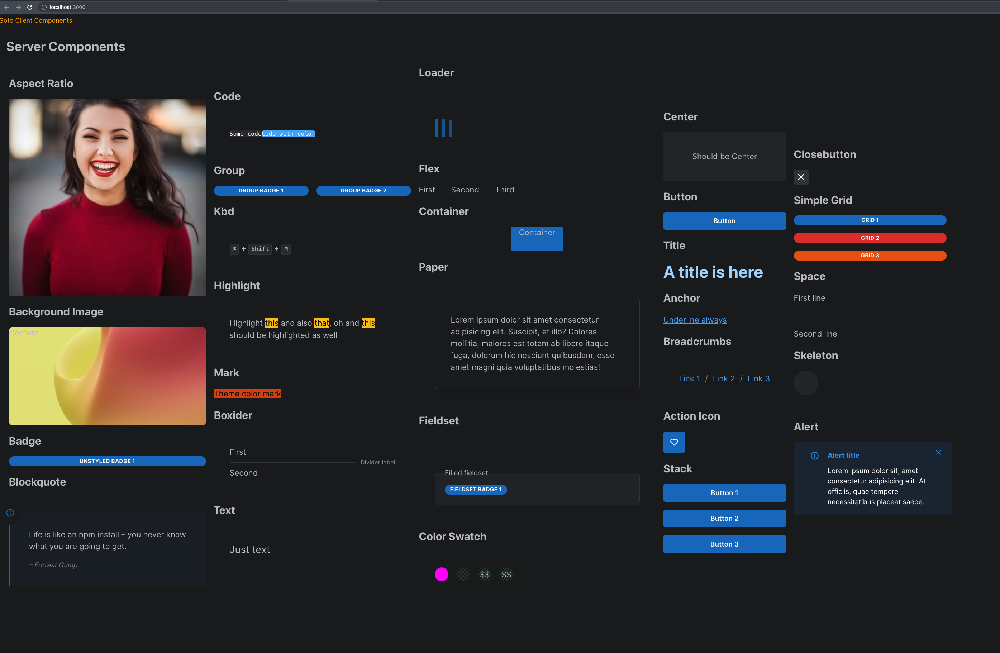

<!-- PROJECT LOGO -->
<br />
<div align="center">
  <a href="https://github.com/paulm17/raikou">
    
  </a>
  <h3 align="center">RAIKOU</h3>
  <p align="center">
    Raikou is a raikou fork which replaces modules.css to use tailwind.
    <br />
    <a href="https://github.com/paulm17/raikou/issues">Report Bug</a>
    ·
    <a href="https://github.com/paulm17/raikou/issues">Request Feature</a>
  </p>
</div>

<!-- ABOUT THE PROJECT -->

## About The Project

Raikou 6 with CSS-in-JS allowed for styles to be adjacent to the component it was styling. However with Raikou 7 styling has switched to CSS Modules. Many in the industry see CSS Modules as a step backwards and I (the fork author) share this sentiment. Therefore forking the project to support tailwind was the obvious choice.

The project was conceived with these 4 long-term goals:

1. To allow for components to behave as server components.
2. To ensure proper tree-shaking for components and purging of unused css. (TBD, waiting for vercel to resolve the client bundle to be tree-shakable)
3. To switch the theme from react context (state) to the tailwind theme. Thereby negating the need to keep the color mode (light/dark) and text direction (left/right) in state.
4. When using the ClassNames api, to ensure that there were no clashes between the bootstrap CSS of the component and tailwind styles provided. This has been made possible with tailwind bootstrapping the styles via a plugin architecture. See for <a href="https://tailwindcss.com/docs/plugins#css-in-js-syntax">more information</a>.

## Project Caveats

1. Remix, Svelte, Solid, Astro and any other frameworks are not supported. There are no intentions of supporting anything other than NextJS.
2. There may be design decisions implemented that will diverge from Raikou. For example the Styles API layer may disappear because it has been superseded by the Classes API and Styles API is <a href="https://v7.raikou.dev/styles/styles-performance#inline-styles">very slow</a>.
3. Issues may be closed due to the fork author not having free time. If an issue is very important, please consider implementing a PR.

<p align="right">(<a href="#readme-top">back to top</a>)</p>

### Built With

[![React][React.js]][React-url]

<p align="right">(<a href="#readme-top">back to top</a>)</p>

<!-- GETTING STARTED -->

## Getting Started

Note: (the following is a placeholder, no packages have been published to npm).
This is an example of how you may give instructions on setting up your project locally.
To get a local copy up and running follow these simple example steps.

### Installation to an application

1. Install the required packages. Same as Raikou.

- npm
  ```sh
  npm install @raikou/client @raikou/hooks @raikou/server @raikou/system
  ```
- yarn
  ```sh
  yarn add @raikou/client @raikou/hooks @raikou/server @raikou/system
  ```

2. Change the content param in tailwind config, to pick up the component Library

   ```sh
   content: [
      "./node_modules/@raikou/server/node_modules/@raikou/**/dist/*",
      "./node_modules/@raikou/client/node_modules/@raikou/**/dist/*",
      "./app/**/*.tsx"
   ],
   ```

   Note: this currently breaks NextJS on refresh, suspect it's on the tailwind side. Will test with the new release of tailwind.

3. Add a preset param in the tailwind config, to pick up the component styles
   ```sh
   presets: [require("./node_modules/@raikou/system/dist/plugin")],
   ```
4. Add a new plugin to the postcss.config.js to purge unused component library styles
   ```js
   "postcss-remove-dumbcss": {
      appPath: "./app",
      libPath: "./node_modules/@raikou/core/src/**/*.ts",
      exts: [".tsx"],
   },
   ```

Change appPath to where the tsx files for your project reside.

<p align="right">(<a href="#readme-top">back to top</a>)</p>

### Cloning the repo

1. Run the following command:

- git
  ```sh
  git clone https://github.com/paulm17/raikou
  ```

2. Install all the package prerequisites
   ```sh
   pnpm i
   ```
3. To run the nextjs website
   ```sh
   pnpm run dev
   ```
4. To run storybook
   ```sh
   pnpm run storybook
   ```

<p align="right">(<a href="#readme-top">back to top</a>)</p>

<!-- USAGE EXAMPLES -->

## Server Components

There are 28 server components available without the need for "use client" in either the component library entry point nor in the page itself. They are: action-icon, anchor, aspect-ratio, background-image, badge, blockquote, box, breadcrumbs, button, center, close-button, code, color-swatch, container, divider, fieldset, flex, group, highlight, kbd, loader, mark, paper, stack, text, title, unstyled-button, visually-hidden.

To use a server component do the following:

```js
import { Badge } from "@raikou/server";

return <Badge>Hello</Badge>;
```

No client payload will be sent to the server. However to use as a client component, just include "use client"

```js
"use client";
import { Badge } from "@raikou/server";

return <Badge>Hello</Badge>;
```

And the page will include all the neccessary client payload for the Badge and the page.

Here is an example of all the components on a page.



##### Some stats for server vs "use client":

- 10 vs 11 requests
- 1.9MB transferred vs 1.7MB transferred
- 8.2MB resources vs 7.1MB resources
- Finished 1.01s vs 1.01s
- Layout.js 108kb
- Page.js 264kb vs 0kb (doesn't exist)

<p align="right">(<a href="#readme-top">back to top</a>)</p>

<!-- ROADMAP -->

## Roadmap

- [x] Create a postcss script to purge unused CSS
- [x] Enable react server components and split packages to server and client
- [x] Tree-shaking for client build
- [x] Use Tailwind Theme, instead of keeping it in state
- [ ] Upgrade tailwind to the new release supporting LightningCSS
- [ ] With the new tailwind release, migrate the postcss script to a LightningCSS transformer. Investigate a Rust port.
- [ ] With the new tailwind release, possibly port the current plugin based css to css files
- [ ] Create a <a href="https://daisyui.com/docs/themes/">theme switcher</a>
- [ ] Fix the Storybook demos to work under version 7

See the [open issues](https://github.com/paulm17/raikou/issues) for a full list of proposed features (and known issues).

<p align="right">(<a href="#readme-top">back to top</a>)</p>

<!-- CONTRIBUTING -->

## Contributing

Contributions are what make the open source community such an amazing place to learn, inspire, and create. Any contributions you make are **greatly appreciated**.

If you have a suggestion that would make this better, please fork the repo and create a pull request. You can also simply open an issue with the tag "enhancement".

Don't forget to give the project a star! Thanks again!

1. Fork the Project
2. Create your Feature Branch (`git checkout -b feature/AmazingFeature`)
3. Commit your Changes (`git commit -m 'Add some AmazingFeature'`)
4. Push to the Branch (`git push origin feature/AmazingFeature`)
5. Open a Pull Request

<p align="right">(<a href="#readme-top">back to top</a>)</p>

<!-- LICENSE -->

## License

Distributed under the MIT License. See `LICENSE.txt` for more information.

<p align="right">(<a href="#readme-top">back to top</a>)</p>

<!-- CONTACT -->

## Contact

Paul M - no social - no email

Project Link: [https://github.com/paulm17/raikou](https://github.com/paulm17/raikou)

<p align="right">(<a href="#readme-top">back to top</a>)</p>

<!-- ACKNOWLEDGMENTS -->

## Acknowledgments

Vitaly and the Raikou community.

<p align="right">(<a href="#readme-top">back to top</a>)</p>

[React.js]: https://img.shields.io/badge/React-20232A?style=for-the-badge&logo=react&logoColor=61DAFB
[React-url]: https://reactjs.org/
