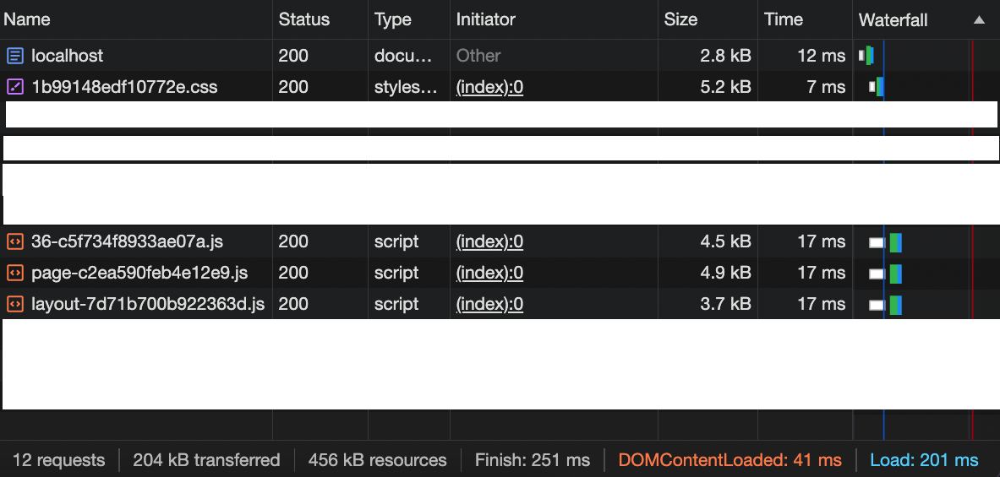

<!-- PROJECT LOGO -->

<a name="readme-top"></a> <br />

<div align="center">
  <a href="https://github.com/paulm17/raikou">
    
  </a>
  <h3 align="center">RAIKOU</h3>
  <p align="center">
    Raikou is a mantine fork which replaces css modules to adopt a unocss first-use approach.
  </p>
  <p align="center">
    <i>Push the envelope, watch it bend.</i>
  </p>
</div>

<!-- ABOUT THE PROJECT -->

## About The Project

Mantine 6 with CSS-in-JS allowed for styles to be adjacent to the component it
was styling. However with Mantine 7 styling has switched to CSS Modules. Many in
the industry see CSS Modules as a step backwards and I (the fork author) share
this sentiment. Therefore forking the project to integrate unocss was the
obvious choice.

The project was conceived with these 4 long-term goals:

1. To make as many components
   <a href="https://nextjs.org/_next/image?url=%2Fdocs%2Fdark%2Fthinking-in-server-components.png&w=3840&q=75">server
   aware</a>.
2. To ensure proper tree-shaking for components and purging of unused css.
3. To ensure that there were no clashes between the bootstrapped CSS of the
   component and unocss styles provided, when using the ClassNames API.
4. To reduce the amount of data sent over each full request:
   - By leveraging the new server paradigm. All the layout components would be
     server based, giving an opportunity to reduce client payload when used
     correctly. Therefore all layout components are server based and leaf
     components being a mixture of both server and client.
   - Using a css purging strategy. Loading CSS for only the components in use.

## Project Caveats

1.  Remix, Svelte, Solid, Astro, Qwik and any other javascript frameworks are
    not supported. There are no intentions of supporting anything other than
    NextJS.
2.  There may be design decisions implemented that will diverge from Mantine.

    - Styles API layer has been removed because it has been superseded by the
      Classes API and Styles API is
      <a href="https://v7.mantine.dev/styles/styles-performance#inline-styles">very
      slow</a>.
    - Mantine and Raikou employ different approaches to manage the theme. While
      Mantine uses context and can be a runtime process for overrides. Raikou
      utilizes a global state for both server and client rendering and overrides
      are done via the unocss configuration.
    - The code responsible for the ColorScheme has been replaced with a more
      lightweight version using
      <a href="https://github.com/pacocoursey/next-themes">Next Themes</a>.
    - When customising a theme, some functionality is encapsulated in a string
      so that the theme can be passed from a server component to a client
      component.
    - Some components have had their javascript removed to make them server
      components primarily.
    - Mantine's color system:
      - 10 shades has been replaced with UnoCSS own colors and 11 shades.
      - The UnoCSS colors can be overriden with the original Mantine color set.
      - The light/dark and other aspects of a component can be overriden. Refer
        to the component css modules file with what css variables have been
        exposed.
      - As part of the postcss process. Raikou will load the complete "mantine"
        styles and purge any unused styling. For example, if only the <Badge />
        component is being used. Only the <Badge /> styling will be present in
        the stylesheet.

<p align="right">(<a href="#readme-top">back to top</a>)</p>

## Why not integrate unocss with mantine in the App?

Integrating Unocss with mantine at the app layer raises the complexity of the
stack, also other issues are present.

### CSS Modules is the wrong choice

Less headaches in dealing with postcss from a developer UX point of view.


<p align="right">(<a href="#readme-top">back to top</a>)</p>

### Built With

[![React][React.js]][React-url]

<p align="right">(<a href="#readme-top">back to top</a>)</p>

### Mirrored Mantine release

0.0.1-beta.9 = 7.3.2

<!-- GETTING STARTED -->

## Getting Started

To get a local copy up and running follow these simple example steps.

### Installation to a NextJS 14 application

1. Install the required packages. Same as Mantine.

- npm

```sh
npm install @raikou/client @raikou/hooks @raikou/server @raikou/system @raikou/global-store @raikou/webpack postcss-unocss-raikou postcss-purgecss-raikou postcss-import
```

- yarn

```sh
yarn add @raikou/client @raikou/hooks @raikou/server @raikou/system @raikou/global-store @raikou/webpack postcss-preset-raikou postcss-unocss-raikou postcss-purgecss-raikou postcss-import
```

2. Change the postcss.config.js to:

```js
module.exports = {
  plugins: {
    "postcss-import": {},
    "postcss-preset-raikou": {},
    "postcss-unocss-raikou": {},
    "postcss-purgecss-raikou": {
      componentNames: "./node_modules/@raikou/system/dist/component_names.txt",
      cssModules: "./node_modules/@raikou/system/dist/css_modules.txt",
      styles: "./node_modules/@raikou/system/dist/styles.css",
    },
  },
};
```

Note:

- `postcss-import` is needed otherwise @layer doesn't work with NextJS.
- `postcss-preset-raikou` is needed in case any external css modules are used in
  the application and raikou functionality will be executed for css modules.
- `postcss-unocss-raikou` is needed as this deploys unocss for raikou.
- `postcss-purgecss-raikou` is needed as this purges unused css and completed
  the process.

Pro-tip: Leave the app build process to minify the final css.

3. Extend next.config.ts for the variant group transformer:

```js
const UnoCSS = require("@raikou/webpack").default;

/** @type {import('next').NextConfig} */
const nextConfig = {
  reactStrictMode: true,

  webpack(config, context) {
    config.plugins.push(new UnoCSS());

    if (context.buildId !== "development") {
      // * disable filesystem cache for build
      // * https://github.com/unocss/unocss/issues/419
      // * https://webpack.js.org/configuration/cache/
      config.cache = false;
    }

    return config;
  },
};

module.exports = nextConfig;
```

4. Create unocss.config.ts:

```js
import { defineConfig } from "unocss";
import presetAttributify from "@unocss/preset-attributify";
import presetWind from "@unocss/preset-wind";
import transformerVariantGroup from "@unocss/transformer-variant-group";
const presetRaikou = require("@raikou/system/plugin.js").default;
import { UnoCSSRaikouTheme } from "@raikou/theme";

export interface RaikouConfig extends UserConfig {
  raikouTheme?: UnoCSSRaikouTheme;
}

export default defineConfig({
  content: {
    filesystem: ["app/**/*.tsx"],
  },
  presets: [
    presetWind({
      dark: "media",
    }),
    presetAttributify({
      prefix: "un-",
    }),
    presetRaikou(),
  ],
  transformers: [transformerVariantGroup()],
} as RaikouConfig);
```

Change `app/**/*.tsx` to the root of the app folder.

Note: ensure presetWind has the dark attribute set to media. Otherwise unocss
styles will not activate for dark theme when setting `dark:bg-blue-500`.

Note: the prefix for attributify has been added, in order to not clash with
mantines own styles and only works for the root level and not classNames.

5. Create global.css with the following:

```css
@layer raikou, default;

@layer default {
  @colors;
  @unocss;
}

@layer raikou {
  @raikou;
}
```

6. Amend layout.tsx to resemble the following. RaikouProvider must encapsulate
   the children. It should resemble something like the following:

```js
import { RaikouProvider } from '@raikou/system';
import { createTheme, setState } from "@raikou/global-store";
import "./global.css";
import config from "../unocss.config";

export default function RootLayout({
   children,
}: {
   children: React.ReactNode
}) {
  const theme = createTheme(config);

  // set server state
  setState({
    theme: theme,
  });

  return (
    <html lang="en">
      <body className={inter.className}>
        <RaikouProvider theme={theme}>{children}</RaikouProvider>
      </body>
    </html>
  )
}
```

7. Raikou has removed the theme overrides from runtime. The theme is now part of
   UnoCss own configuration file. Simply add new "mantine" theme params to the
   defineConfig object under the param raikouTheme.

```js
export default defineConfig({
  ...
  raikouTheme: {
    primaryColor: "sky",
  },
} as RaikouConfig);
```

Note:

RaikouTheme now includes two new string array params to control which colors are
created in the global stylesheet. `IncludeColors` allows for only these colors
to be created. `excludeColors` allows for all the colors except these to be
created. Ignore these two params if all colors are to be present in the
stylesheet.

Raikou supports the original mantine colors in 10 shades but unocss colors as
well. All Raikou colors have 11 values.

8. Mantine Colors can override the supplied unocss colors. Extend the config as
   below:

```js
import { MantineColors } from "@raikou/theme";

export default defineConfig({
  ...
  theme: {
    colors: MantineColors,
  },
}) as any;
```

Colors can also be overridden on a singular basis:

```js
import { generateColors } from "@raikou/colors-generator";

export default defineConfig({
  ...
  theme: {
    colors: {
      blue: generateColors("#5474B4"),
    },
  },
}) as any;
```

9. The theme components api has changed from the
   <a href="https://v7.mantine.dev/styles/variants-sizes#sizes-with-components-css-variables">original
   documentation</a>:

```js
export default defineConfig({
  ...
  raikouTheme: {
    ...
    components: {
      Button: {
          vars: `
          if (props.size === "xxl") {
            return {
                root: {
                "--button-height": rem(60),
                "--button-padding-x": rem(30),
                "--button-fz": rem(30),
                },
            };
          }

          return { root: {} };
          `,
      },
    },
  },
} as RaikouConfig);
```

10. To override css variables, create a `cssVariablesResolver` object in the
    Raikou theme and encapsulate it with JSON.stringify:

Note: when referencing the theme use dot notation as in the example.

```js
import { rem } from "@raikou/theme";

export default defineConfig({
  ...
  raikouTheme: {
    ...
    other: {
      deepOrangeLight: "#E17900",
      deepOrangeDark: "#FC8C0C",
    },
    cssVariablesResolver: JSON.stringify({
      variables: {
        "--raikou-hero-height": rem(20),
        "--raikou-hero-width": rem(20),
      },
      light: {
        "--raikou-color-deep-orange": "theme.other.deepOrangeLight",
        ".button-root": {
          "--raikou-button-disabled-bg": "#E17900",
        },
      },
      dark: {
        "--raikou-color-deep-orange": "theme.other.deepOrangeDark",
        ".button-root": {
          "--raikou-button-disabled-bg": "#FC8C0C",
        },
      },
    }),
  },
} as RaikouConfig);
```

<p align="right">(<a href="#readme-top">back to top</a>)</p>

11. The classNames API has been updated to support attributify.

A key can either be a string if the styles are terse, or broken up into
attributes.

```js
<Badge
  classNames={{
    root: "bg-red-500",
    label: {
      bg: "blue-500",
      text: "gray-300",
      m: "[20px]",
      p: "[80px]",
    },
  }}
>
  This is a badge
</Badge>
```

<p align="right">(<a href="#readme-top">back to top</a>)</p>

12. Any mantine css variable that requires any color can be overriden by a
    unocss color. The only stipulation is that the unocss color must be enclosed
    in var brackets. Finally, a css variable like --badge-bg or background or
    color can only be used.

Note: this dynamically adds the color equivilent to the css for both css
variables color-violet-800 and color-red-300.

```js
<Chip
  checked
  variant="filled"
  style={{
    "--chip-bg": "var(--color-violet-800)",
    color: "var(--color-red-300)",
  }}
>
  Programming
</Chip>
```

<p align="right">(<a href="#readme-top">back to top</a>)</p>

### Cloning the repo

1. Run the following command

```sh
git clone https://github.com/paulm17/raikou
```

2. Install all the package prerequisites

```sh
pnpm i
```

3. To run the nextjs website

```sh
pnpm run dev
```

4. To run storybook

```sh
pnpm run storybook
```

<p align="right">(<a href="#readme-top">back to top</a>)</p>

<!-- USAGE EXAMPLES -->

## Server Components

There are 41 server components available without the need for "use client" in
either the component library entry point nor in the page itself. They are:
action-icon, alert, anchor, \*app-shell, aspect-ratio, background-image, badge,
blockquote, box, breadcrumbs, button, card, center, close-button, code,
color-swatch, container, divider, fieldset, flex, grid, group, highlight,
\*image, indicator, kbd, list, loader, mark, paper, skeleton, simple-grid,
space, stack, \*table, text, timeline, title, unstyled-button, visually-hidden.

### Changes to components

The following components have been altered from the original mantine spec:

1. App Shell

Used javascript for prettier resizing of the components. This has been removed.

2. Image

Used javascript to replace the image with a fallback, should the source fail to
load. As this is a server component. If the fallback prop is used, the server
does a request to see if the source exists. If it does not then the fallback is
shown. Ensure the fallback is an image you know is dependable.

Should the component be marked as a client component, it is currently out of
scope to determine whether the image has failed to load on the client. At a
future date this maybe resolved.

3. Table

Used javascript for allowing the body to be scrollable. In future, will look how
to inject back this functionality should the table be a client component.

## Server component usage

To use a server component do the following:

```js
import { Badge } from "@raikou/server";

return <Badge>Hello</Badge>;
```

No client payload will be sent to the server. However to use as a client
component, just include "use client"

```js
"use client";
import { Badge } from "@raikou/server";

return <Badge>Hello</Badge>;
```

And the page will include all the neccessary client payload for the Badge and
the page.

## Client/Server Components - Mantine vs Raikou

Using the default NextJS 14 install. Here is an example of just 1 component.

Raikou client vs Mantine when built. Only the badge is loaded and with Mantine
only global css + badge css is loaded to make it fair.

- Raikou client: 174kB transferred, 410kB resources
- Mantine: 204kB transferred, 456kB resources

Note: Stats are created via pnpm build and pnpm start.

##### Network tabs (Mantine vs Raikou)

<p float="left">
  
  
</p>

##### Raikou server vs client

When omitting "use client" this results in Page.js not being requested.

<p float="left">
   
</p>

- Raikou server: 166kB transferred, 385kB resources

Note: Stats are created via pnpm build and pnpm start.

<p align="right">(<a href="#readme-top">back to top</a>)</p>

<!-- ROADMAP -->

## Roadmap

- [x] Enable react server components and split packages to server and client
- [x] Tree-shaking for client build
- [x] Replace the context provider that components use for state
- [x] Match or significantly improve the amount of data that is sent on each
      full request
- [x] Create a postcss script to purge unused CSS
- [x] Replace Mantine ColorScheme code with Next-Themes
- [x] Create a <a href="https://daisyui.com/docs/themes/">theme switcher</a>
      similar to Daisy UI. See the
      <a href="https://github.com/paulm17/raikou/blob/main/apps/web/app/themer/page.tsx">/themer
      endpoint</a>.
- [ ] Fix the Storybook demos to work under version 7

<p align="right">(<a href="#readme-top">back to top</a>)</p>

<!-- CONTRIBUTING -->

At this time, no contributions are sought. Thank you.

<p align="right">(<a href="#readme-top">back to top</a>)</p>

<!-- LICENSE -->

## License

Distributed under the MIT License. See `LICENSE.txt` for more information.

<p align="right">(<a href="#readme-top">back to top</a>)</p>

<!-- CONTACT -->

## Contact

Paul M - no social - no email

<p align="right">(<a href="#readme-top">back to top</a>)</p>

<!-- ACKNOWLEDGMENTS -->

## Acknowledgments

- [Vitaly and the Mantine community.](https://mantine.dev/)<br>
- [Ionut-Cristian Florescu for Mantine DataTable and Mantine ContextMenu.](https://github.com/icflorescu)

<p align="right">(<a href="#readme-top">back to top</a>)</p>

[React.js]:
  https://img.shields.io/badge/React-20232A?style=for-the-badge&logo=react&logoColor=61DAFB
[React-url]: https://reactjs.org/

<p align="right">(<a href="#readme-top">back to top</a>)</p>
